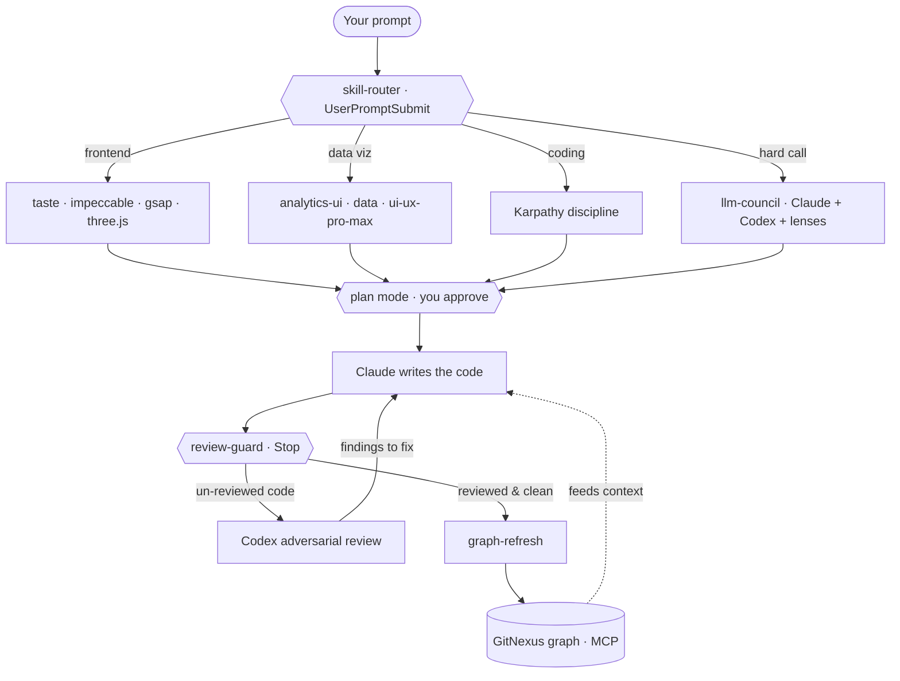

<div align="center">

# CStack

### The Cohedo Code Stack — a one-command Claude Code power-setup.

A different-family model that **attacks every diff before it ships**. A **live graph** of your
codebase. Curated **design + coding skills** that fire on their own. All wired together with hooks,
so you don't have to remember any of it.


</div>

---

> Vanilla Claude Code ships confident bugs, forgets your codebase between turns, and has no
> particular taste. CStack fixes all three — and **enforces** the fixes with hooks, so quality
> isn't a thing you have to remember to ask for.

## Why

I wanted a Claude Code that reviews itself. Not "please double-check" — actually *reviews*: a
second model from a different family, prompted to break the code, run on **every** change before it
counts as done. Then I wanted it to stop re-reading my repo from scratch every session, and to stop
producing generic-looking frontends. CStack is the result — three upgrades, wired so they run on
their own:

- **A reviewer that can't be skipped.** Codex (GPT) attacks each diff; a Stop hook won't let a
  coding turn finish until the review has run.
- **Memory of your code.** GitNexus indexes the repo into a knowledge graph exposed over MCP —
  impact analysis, call-path tracing, blast radius — so the agent understands code instead of
  grepping blind.
- **Taste, on tap.** Curated skills for design, animation, 3D, and coding discipline that
  auto-activate from what you ask — you never name them.

## What you get

| Layer | What it is | What it buys you |
|---|---|---|
| **Plan gate** | plan mode, on non-trivial work | you approve the approach + skill map before anything executes |
| **Reviewer** | Codex (GPT) on your ChatGPT auth | a different-family model attacks every diff before it's "done" |
| **Graph** | GitNexus, over MCP | a live map of your code — impact, call-paths, change detection |
| **Skills** | 9 plugins + 10 three.js skills | design taste, GSAP, three.js, Karpathy's coding discipline |
| **Analytics UI** | `analytics-ui` skill + `data` + `ui-ux-pro-max` plugins | professional charts & dashboards — a pro chart stack (Recharts/shadcn/ECharts) + color/selection/layout/a11y rules, composed with the data brain |
| **Council** | `llm-council` skill | Claude + Codex + 7 lenses, for genuinely hard calls |
| **Reach** | [Agent Reach](https://github.com/Panniantong/Agent-Reach) + `agent-reach` skill | internet access — read any URL and research across 15 platforms (Twitter/X, Reddit, YouTube, GitHub, RSS, LinkedIn, web search, …), 7 live with zero config |
| **Enforcement** | 4 hooks | reviews are mandatory, the graph auto-refreshes after review, skills auto-route |
| **Doctrine** | `~/.claude/CLAUDE.md` | the operating rules the whole stack follows |

## Quick start

One command — it installs everything and prints the auth steps at the end:

```bash
curl -fsSL https://raw.githubusercontent.com/IdoCohen560/CStack/main/setup.sh | bash
```

Prefer to read before you run (it's one file, no magic)?

```bash
git clone https://github.com/IdoCohen560/CStack.git && cd CStack
less setup.sh          # inspect it
./setup.sh
```

**Make it yours.** CStack is authored by IdoCohen560 — but your work should be *yours*. Setup prompts
**once** for your own git identity (name/email) so commits are never misattributed, then never asks
again. Already have your own git identity set? It's left untouched. If you cloned this repo, point
`origin` at your own fork before publishing your own version.

Then the three things only you can do:

```bash
gh auth login                 # 1. GitHub
codex login                   # 2. the reviewer — choose "Sign in with ChatGPT"
# 3. restart Claude Code so skills, plugins, and hooks load
```

**Stop here.** Open any git repo, run `gitnexus analyze --embeddings` once, and start working. The
review gate, the graph, and the skills come online on their own — nothing else to configure.

## How it works



Every arrow is a hook or an MCP call doing its job without you. You ask; the router points the right
skills at it; Claude writes; the guard refuses to finish until Codex has attacked it; once it's
reviewed, the graph re-indexes so the next turn is smarter.

## The layers

### 1. Cross-model review — the whole point

One model writing and grading its own work re-runs its own blind spots. CStack makes a **different
family** (Codex / GPT, on your ChatGPT Plus auth so it bills to OpenAI, not your Claude quota) attack
each diff — prompted to *refute* the code's claims, not admire it. It's not optional: `review-guard`
blocks a coding turn from ending until the review has run, and stays completely silent on chat and
docs. Invoke on demand with `/codex:adversarial-review`.

### 2. A live graph of your code

`gitnexus analyze` indexes a repo into a local knowledge graph (offline, in `.gitnexus/`) exposed to
Claude over MCP: blast-radius/impact analysis, call-path tracing, symbol context, change detection.
After every review, `graph-refresh` re-indexes the reviewed code in the background — so the graph is
always current and the agent understands your code instead of guessing.

### 3. Skills that fire on their own

Installed as plugins + skills, auto-routed by a `UserPromptSubmit` hook and a routing map in
`CLAUDE.md`. You describe the task; the right skills apply themselves.

| Skill | Source | For |
|---|---|---|
| `taste-skill` | [Leonxlnx/taste-skill](https://github.com/Leonxlnx/taste-skill) | design taste — kills generic-slop UI |
| `impeccable` | [pbakaus/impeccable](https://github.com/pbakaus/impeccable) | design fluency · `/impeccable polish\|audit\|critique` |
| `gsap-skills` | [greensock/gsap-skills](https://github.com/greensock/gsap-skills) | GSAP animation, done right |
| `threejs-*` | [CloudAI-X/threejs-skills](https://github.com/CloudAI-X/threejs-skills) | 3D / WebGL / shaders |
| `andrej-karpathy-skills` | [multica-ai/andrej-karpathy-skills](https://github.com/multica-ai/andrej-karpathy-skills) | think first, simplest surgical change |
| `agent-browser` | [vercel-labs/agent-browser](https://github.com/vercel-labs/agent-browser) | drive a browser to test UI |
| `claude-video-vision` | [jordanrendric/claude-video-vision](https://github.com/jordanrendric/claude-video-vision) | watch & understand video |
| `ui-ux-pro-max` | [nextlevelbuilder/ui-ux-pro-max-skill](https://github.com/nextlevelbuilder/ui-ux-pro-max-skill) | pro UI/UX design intelligence — tokens, palettes, 25 charts |
| `data` | [anthropics/knowledge-work-plugins](https://github.com/anthropics/knowledge-work-plugins) | SQL · analysis · `build-dashboard` · data-visualization |
| `analytics-ui` | CStack (authored) | the design layer for data — pro chart stack + color/selection/layout/a11y rules |

### 4. Analytics UI — professional charts & dashboards

Data visualization is its own discipline, so CStack ships a dedicated layer that fires on any chart,
graph, dashboard, KPI, or "visualize this data" task. Three pieces **compose** (never one-or-the-other):
the `data` plugin (Anthropic) is the **analytics brain** — SQL, exploration, statistics, chart
selection, and a `build-dashboard` command; `ui-ux-pro-max` brings pro design tokens, palettes, and
chart styles; and the authored **`analytics-ui`** skill is the **design layer for data** — it pins a
professional stack (**shadcn/ui Charts on Recharts + Tremor** for the 80% case, **ECharts/Perspective**
for heavy/streaming data, **visx/D3** for bespoke) and enforces design-grade rules for color
(categorical/sequential/diverging + colorblind-safe tokens), chart selection (and anti-patterns —
no pie>3, no dual-axis, no truncated bars), dashboard layout, restrained motion, and accessibility.
The result reads Stripe/Linear/Vercel-grade, not like a library default. It layers on top of
`taste-skill` + `impeccable` for the surrounding UI and `gsap-skills` for motion.

### 5. Reach — internet access for your agent

[Agent Reach](https://github.com/Panniantong/Agent-Reach) gives the agent eyes on the internet: it
installs, routes, and health-checks free upstream tools for 15 platforms, and exposes them through
the `agent-reach` skill that auto-activates on any URL or research/search task. **7 channels work
with zero config** — read any web page, YouTube (transcripts), GitHub, RSS, V2EX, Bilibili search,
and semantic **web search** (Exa MCP, no API key). The eight login-gated platforms (Twitter/X,
Reddit, Facebook, Instagram, XiaoHongShu, LinkedIn, Xueqiu) unlock on demand — just tell the agent
"help me set up Twitter". Run `agent-reach doctor` to see which backend is live for each. The CLI is
isolated in its own `pipx` venv; state lives in `~/.agent-reach/`, never in your repo.

### 6. The council — for the hard calls only

A local reimplementation of [Karpathy's LLM-Council](https://github.com/karpathy/llm-council):
independent answers → anonymized peer ranking → chairman synthesis. Members are **Claude + Codex**
(no third-party router, by design); diversity is multiplied by **7 lenses** — correctness,
simplicity, security, performance, UX, cost, and a mandatory red-team skeptic. Gated hard: it only
convenes when a single answer would be risky *and* viewpoints would genuinely disagree.

### 7. The hooks

| Hook | Event | Job |
|---|---|---|
| `review-baseline.sh` | SessionStart | baselines pre-existing changes so only *this session's* code is gated |
| `review-guard.sh` | Stop | blocks finishing until code changes are cross-model reviewed |
| `graph-refresh.sh` | Stop | re-indexes GitNexus after a review — background, non-blocking |
| `skill-router.sh` | UserPromptSubmit | detects task type, nudges the right skills, and on non-trivial work prompts a plan-first step (you approve via plan mode) |

All hooks **fail open** — a broken hook never traps your session — and were hardened through two
rounds of Codex adversarial review (16 findings fixed) plus a scenario test suite.

### 8. The doctrine

`~/.claude/CLAUDE.md` — the always-loaded operating rules: orchestrate don't grind, review is the
mandatory closing step, verify don't trust self-reported success, and the skill-routing map. It's
short on purpose; it's re-read every session.

## What CStack deliberately does *not* install

Curation is half the value. Left out on purpose:

- **Model-training repos** (e.g. OpenMythos) — you can't bottle a frontier model from a repo; it gives agents nothing.
- **Libraries, not skills** — GSAP, react-bits, 3dsvg, Remotion are things you `npm i` *inside a project*, not Claude skills. (The skill that teaches GSAP — `gsap-skills` — is installed.)
- **Agent-governance toolkit** — off-theme, and it installs its own session hooks that fight ours. The marketplace line is in `setup.sh`, commented out.

## Requirements

macOS with [Homebrew] · Node/npm · git · jq · [Claude Code] · a ChatGPT Plus/Pro account (for the
reviewer). `setup.sh` installs the rest.

## Uninstall

```bash
./uninstall.sh          # removes hooks, custom skills, and the plugins CStack added
```

## Credits

CStack is glue and doctrine around excellent third-party work — full credit to the authors of
[taste-skill], [impeccable], [gsap-skills], [threejs-skills], [andrej-karpathy-skills],
[agent-browser], [claude-video-vision], [GitNexus], the [Codex plugin], and Andrej Karpathy's
[LLM-Council] method. Their licenses are their own.

## License

MIT — fork it, improve it, make it yours.

[Homebrew]: https://brew.sh
[Claude Code]: https://claude.com/claude-code
[taste-skill]: https://github.com/Leonxlnx/taste-skill
[impeccable]: https://github.com/pbakaus/impeccable
[gsap-skills]: https://github.com/greensock/gsap-skills
[threejs-skills]: https://github.com/CloudAI-X/threejs-skills
[andrej-karpathy-skills]: https://github.com/multica-ai/andrej-karpathy-skills
[agent-browser]: https://github.com/vercel-labs/agent-browser
[claude-video-vision]: https://github.com/jordanrendric/claude-video-vision
[GitNexus]: https://www.npmjs.com/package/gitnexus
[Codex plugin]: https://github.com/openai/codex-plugin-cc
[LLM-Council]: https://github.com/karpathy/llm-council
